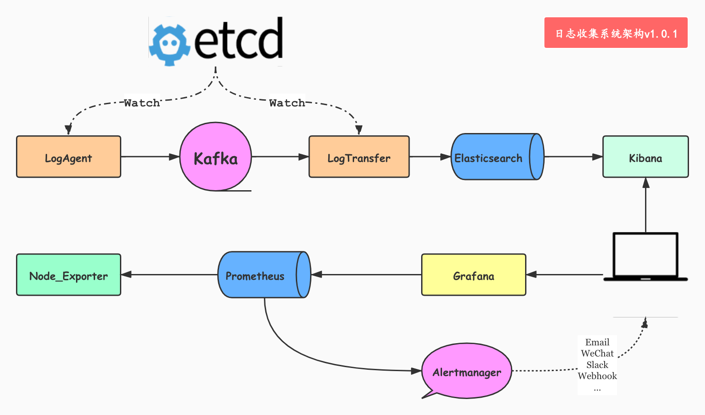

# logCollect 日志收集服务

## 软件架构

---
**说明**

通过在运维平台上配置日志收集项，logAgent从etcd中获取要收集的日志信息从业务服务器读取日志信息，发往kafka，logTransfer负责从kafka读取日志，写入到Elasticsearch或者Prometheus，通过Kibana进行日志检索和Grafana进行可视化展示。

---

## v0.1.0版本实现的功能

- 读取日志文件

- 写入到kafka中

- 可以自行配置要收集的日志文件

## v0.2.0版本实现的功能

- 从etcd中获取日志收集项

- logAgent可以同时运行多个日志收集任务

- 实现实时配置项变更

- 根据当前服务器的IP地址获取配置项

## v0.3.0版本增加logTransfer服务

- 实现日志入库到ES

- 使用第三方日志框架logrus保存日志

- 支持日志文件切割

- 加入消费组，支持多个topic

## 配套教程

[Go运维开发之日志收集（1）收集应用程序到kafka中](https://huangzhongde.cn/post/2020-03-03-golang_devops_logAgent_1_write_log_to_kafka/)

[Go运维开发之日志收集（2）从etcd中获取配置信息](https://huangzhongde.cn/post/2020-03-04-golang_devops_logAgent_2_get_config_from_etcd/)

[Go运维开发之日志收集（3）根据etcd配置项创建多个tailTask](https://huangzhongde.cn/post/2020-03-04-golang_devops_logAgent_3_get_config_from_etcd_create_tailtask/)

[Go运维开发之日志收集（4）监视etcd配置项的变更](https://huangzhongde.cn/post/2020-03-04-golang_devops_logAgent_4_watch_config_from_etcd/)

[Go运维开发之日志收集（5）根据IP地址去拉取配置日志收集项](https://huangzhongde.cn/post/2020-03-04-golang_devops_logAgent_5_get_conf_adapter_ipaddr/)

[Go运维开发之日志收集（6）从kafka中获取日志信息](https://huangzhongde.cn/post/2020-03-05-golang_devops_logAgent_6_get_data_from_kafka/)

[Go运维开发之日志收集（7）将日志入库到Elasticsearch并通过Kibana进行展示](https://huangzhongde.cn/post/2020-03-05-golang_devops_logAgent_7_write_to_es/)

[Go运维开发之日志收集（8）将应用程序日志写入到文件中](https://huangzhongde.cn/post/2020-03-05-golang_devops_logAgent_8_with_logrus/)

[Go运维开发之日志收集（9）logTransfer支持多个Topic](https://huangzhongde.cn/post/2020-03-10-golang_devops_logAgent_9_kafka_consumer_group_multi_topics/)

